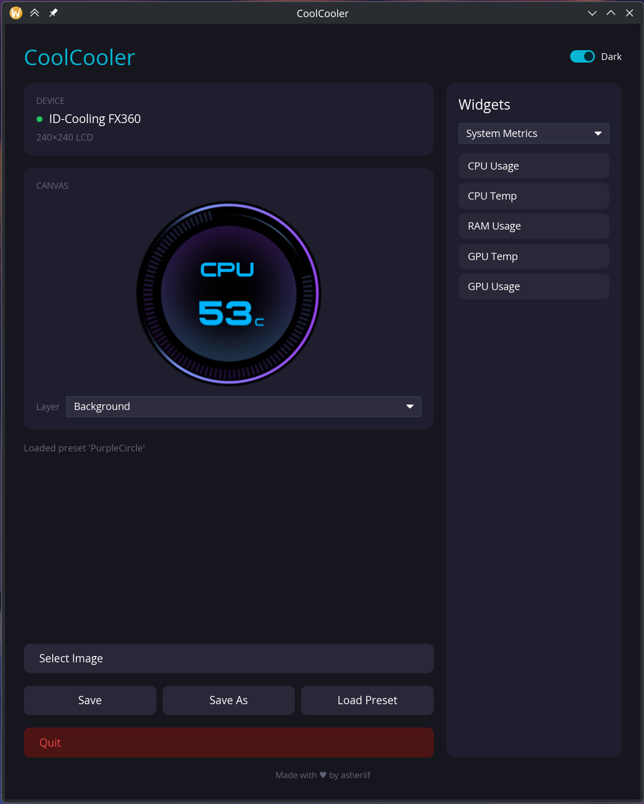
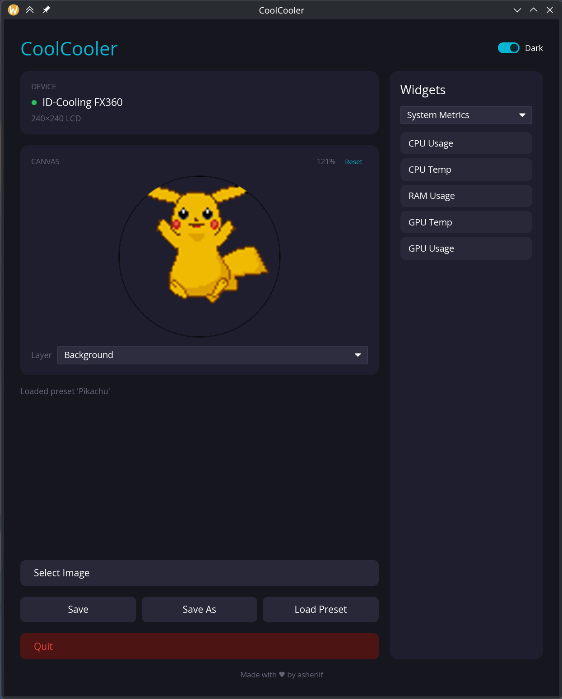

# CoolCooler

CoolCooler is a Rust desktop app for controlling LCD screens on AIO liquid coolers. It started with native support for the ID-Cooling FX360 and also includes a `liquidctl`-backed path for several file-transfer LCD coolers.

The GUI is built with `iced` and supports static images, GIF backgrounds, a circular hardware preview, zoom/pan controls, widget overlays, presets, and close-to-tray behavior.

## Screenshots

<p align="center">
  
  
  
</p>

## Status

This project is early and hardware-focused. Expect rough edges, especially around device support, desktop integration, and packaging on distributions that differ from the current test systems.

## Supported Devices

Native streaming support:

- ID-Cooling FX360, 240x240 LCD, native USB streaming

`liquidctl` file-transfer support:

- NZXT Kraken Z
- NZXT Kraken 2023
- NZXT Kraken 2023 Elite
- NZXT Kraken 2024 Elite RGB
- NZXT Kraken 2024 Plus
- MSI MPG CoreLiquid K360

Native streaming devices support live GIF playback and dynamic widget overlays. File-transfer devices use `liquidctl` and are best suited to static images; animated backgrounds with widgets are intentionally blocked because updates are too expensive.

## Quick Start

For ID-Cooling native USB access, install the udev rule once:

```bash
sudo ./install-udev-rules.sh
```

The installer reloads and triggers udev rules. If the cooler is still not detected afterward, reboot so the new device permissions are applied cleanly. For `liquidctl` devices, make sure `liquidctl` is installed and can control the device from your user session.

Download the built AppImage from releases and double click it, or build it (see below), then run:

```bash
./dist/CoolCooler-0.1.0-x86_64.AppImage
```

## Build From Source

Requirements:

- Rust stable
- Linux system libraries for USB/device access
- `liquidctl` for supported file-transfer devices

Build and test:

```bash
cargo build --workspace
cargo test --workspace
cargo clippy --workspace --all-targets -- -D warnings
```

Run the GUI:

```bash
cargo run -p coolcooler-gui
```

Run the CLI test tool:

```bash
cargo run -p coolcooler-cli -- test
cargo run -p coolcooler-cli -- color '#00ffaa'
cargo run -p coolcooler-cli -- image ./image.png
```

## AppImage Packaging

Build the release AppImage in a dedicated Ubuntu 22.04 distrobox for broader compatibility. Create the container once from the repository root:

```bash
mkdir -p "$HOME/distroboxes/CoolCoolerAppImageHome"
distrobox create \
  --yes \
  --name CoolCoolerAppImage \
  --image docker.io/library/ubuntu:22.04 \
  --home "$HOME/distroboxes/CoolCoolerAppImageHome" \
  --additional-packages "build-essential ca-certificates curl pkg-config libudev-dev libxkbcommon-dev libwayland-dev libegl1-mesa-dev libgl1-mesa-dev"
```

Install Rust inside that container if it is not already available:

```bash
distrobox enter CoolCoolerAppImage -- bash -lc 'command -v cargo >/dev/null || curl --proto "=https" --tlsv1.2 -sSf https://sh.rustup.rs | sh -s -- -y'
```

Then simply run the AppImage build wrapper normally from your host:

```bash
packaging/appimage/build-appimage-in-distrobox.sh
```

Output is written to:

```text
dist/CoolCooler-0.1.0-x86_64.AppImage
```

The wrapper enters the `CoolCoolerAppImage` distrobox, loads Rust from `$HOME/.cargo/env`, builds `coolcooler-gui` in release mode, downloads `linuxdeploy` if needed, and writes the finished AppImage to `dist/`. To use a differently named container, set `COOLCOOLER_DISTROBOX=YourBoxName` before running the wrapper.

The inner script can also be run directly from a prepared Linux build environment:

```bash
packaging/appimage/build-appimage.sh
```

## Project Layout

```text
crates/coolcooler-core       Shared traits, types, errors, and frame preparation
crates/coolcooler-idcooling  Native ID-Cooling FX360 protocol and USB transport
crates/coolcooler-liquidctl  Device registry and liquidctl command integration
crates/coolcooler-driver     Unified detection and display-loop driver layer
crates/coolcooler-cli        Test CLI
crates/coolcooler-gui        iced desktop GUI, widgets, presets, and tray support
assets/                      Bundled icons and fonts
packaging/appimage/          AppImage metadata and build scripts
```

## Presets and Data

User presets are stored in XDG data storage, normally:

```text
~/.local/share/coolcooler/presets/
```

They are not stored inside the AppImage or repository checkout.

## Notes

- KDE Plasma should show both taskbar and system tray icons. GNOME may require an AppIndicator/StatusNotifier extension for tray visibility.
- AppImage builds intentionally use the host `libudev.so.1` at runtime.
- The current udev helper only covers the ID-Cooling native USB device.

## License

CoolCooler is licensed under the GNU General Public License v3.0 or later. You may use, modify, fork, and redistribute it, including commercially, but distributed copies and modified versions must preserve the same GPL freedoms and provide corresponding source code.

See [LICENSE](LICENSE) for the full license text. Unless explicitly stated otherwise, contributions are licensed under `GPL-3.0-or-later`.
